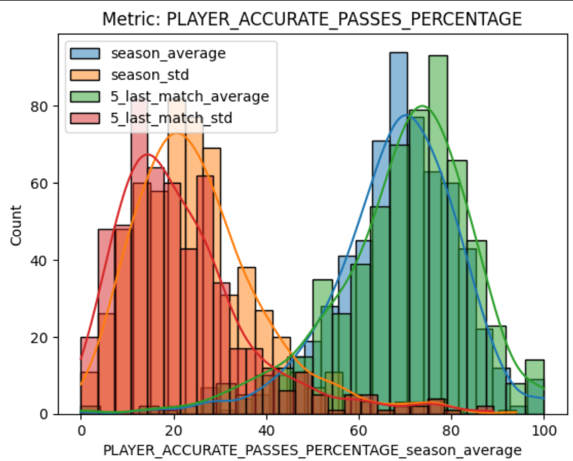

# QRT-Data-Challenge-Football
Repository for the Data Challenge organized by QRT on match results prediction.

By Timothé Boulet and Théo Saulus, 2024, for the course "Apprentissage et génération par échantillonnage aléatoire" of Stéphane Mallat at ENS.

<p align="center">
  
</p>

This repository has limited maintenance and is not intended to be run by anyone else than the authors. The interest of this repository is rather :
- to show the code we wrote for the challenge
- to share the data visualizations we made (the ./data_vis_`x_name`.ipynb notebooks)
- to share the report we wrote (the report.pdf file)

## Installation
Clone the repo, do a venv, and install the requirements with the following command:
```bash
git clone git@github.com:tboulet/QRT-Data-Challenge-Football.git
cd QRT-Data-Challenge-Football
python3 -m venv venv
source venv/bin/activate
pip install -r requirements.txt
```

Then load the data from the ENS Data Challenge website and put it in the `./data_train/` and `./data_test/` folders (that you have to create).

## Usage

To run a model (e.g. XGBoost) on the data, you can use the following command:
```bash
python run.py trainer=xgb
```

The config of the feature engineering, the model along its hyperparameters, and the way we are predicting are stored in the `configs/` folder. 